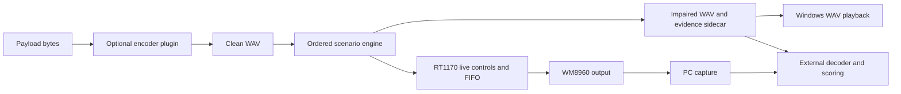

# Waveform generator

Copyright (C) 2026 **Paul R. Decker**.

Create repeatable 48 kHz test audio, mix controlled interference into it, and
save or play the result on Windows or the original **MIMXRT1170-EVK / WM8960**.
The default build plays supplied WAV files and applies interference. Optional
user-supplied encoder plugins can create additional waveforms at build time.

## 50,000-foot view



| Capability | Current implementation |
|---|---|
| Generate clean vectors | Calibration tone script; optional user-supplied encoder plugins |
| Mix a retained WAV | `signal_lab_render`: CW, band-limited AWGN, impulses, fades, sample slips |
| Hear a WAV on the PC | `host/play_wav.py`: explicit WASAPI output, including Realtek headphones when enumerated |
| Play on the board | `rt1170-player-*`: SD file player, static scenarios, live CW/static/fade controls |
| Record analog evidence | `waveform_capture`: WinMM or raw WASAPI input |
| Reproduce a live experiment | Acknowledged frame-indexed journals and offline replay |
| Build a campaign | Corpus recipes, reference validation, retained scores and manifests |

PC playback is a Python/PortAudio convenience player for already-rendered WAVs.
The C++ engine does not yet have a native Windows live output backend or a GUI.
Its deterministic artifact can be replayed through Windows shared-mode audio;
Windows volume, processing and the DAC affect the physical result.

For two runnable demonstrations (generated signal and downloaded WAV), start with
[How to use](docs/how-to-use.md). Both can render effects and play on an exact
Windows output.

For the shortest path, use the [Quick start](docs/quickstart.md). Module authors
can follow [Custom encoder and CDC tutorial](docs/custom-encoder-tutorial.md).

## 1. Get dependencies and build

Run these commands from this repository root. Install Git, Python 3.10 or newer,
CMake 3.27 or newer, and a C++23 MinGW toolchain with `mingw32-make` on PATH.
The supplied host presets use MinGW Makefiles. GNU 14.2 is the tested compiler.

```powershell
.\scripts\init-dependencies.ps1
python -m pip install -r host/requirements-test.txt
cmake --preset host-release
cmake --build --preset host-release --parallel
.\scripts\test.ps1

# Optional Windows playback and physical USB control helpers:
python -m pip install -r host/requirements-playback.txt
python -m pip install -r host/requirements-control.txt
```

The six dependencies are ordinary Git submodules. The initialization script
checks them out without downloading nested upstream examples. A GitHub
source ZIP is insufficient. Normal configure/build performs no network fetches or SHA-lock validation.
The reviewed [SDMMC and FatFs patches](patches/README.md) are applied to copies
under the build directory; the upstream working trees remain clean.

For firmware, install the Arm GNU toolchain at the path in
[CMakePresets.json](CMakePresets.json), or provide a matching local preset:

```powershell
cmake --preset rt1170-player-release
cmake --build --preset rt1170-player-release --parallel
```

| Preset family | Firmware purpose |
|---|---|
| `rt1170-*` | Stopped scaffold; not the file player |
| `rt1170-tone-*` | Resident codec-tone checkpoint |
| `rt1170-player-*` | Writable CDC/MSC player; generation when a plugin is enabled; PID `0x4012` |
| `rt1170-player-readonly-*` | Inspection player, write-protected MSC/FatFs; PID `0x4013` |
| `rt1170-sdcard-*`, `rt1170-sdcard-identify-*` | SD diagnostic images |

Each family has Debug and Release presets. Select a board-matched firmware image
and probe when loading it with the installed debugger/programmer. A successful
link does not establish that the image has been loaded or tested on a board.
See [RT1170 Player and Audio](docs/modules/rt1170-player-and-audio.md) for the
hardware path and [Build and dependencies](docs/modules/build-and-dependencies.md)
for toolchain setup, test cleanup and local path checks.

## 2. Make or select a clean WAV

Use an existing mono 48 kHz PCM24 WAV, or create a ten-second calibration tone:

```powershell
New-Item -ItemType Directory -Force build/demo | Out-Null
python host/stage_wav.py make-tone --output build/demo/clean.wav
python host/stage_wav.py inspect build/demo/clean.wav
```

No encoder module is needed for file playback, CW, noise, fades, capture or replay.
To compile your own waveform producer, follow [Encoder plugins](docs/encoder-plugins.md).
The public `TONE` example demonstrates registration, bounded streaming and workspace
ownership. Modules for other waveform families can live in separate repositories.

| File path | Accepted / produced format |
|---|---|
| C++ renderer input | Mono 48 kHz PCM24; legacy PCM16 input also supported |
| Plugin WAV writer and C++ renderer output | Mono 48 kHz packed PCM24 |
| RT1170 staged input | Mono 48 kHz packed PCM24; checked by `stage_wav.py` |
| Python reference renderer | Mono 48 kHz packed PCM24; legacy PCM16 input supported |
| PC convenience playback | Mono 48 kHz PCM16 or PCM24; duplicated to stereo output |
| Host analog capture | Mono 48 kHz IEEE-float WAV |

An arbitrary stereo, 44.1 kHz, compressed, or float capture file needs an explicit
conversion before use as a source. These tools do not silently resample it.

## 3. Mix CW interference into the file

The checked-in [900 Hz CW recipe](examples/cw-900hz.json) adds a continuous tone
at **C/I = 6 dB**, with a short ramp. The interferer RMS is about half the clean
reference RMS. Lower C/I means stronger interference. `source_gain_db` is
explicitly −6 dB in this example to leave room for the added tone. It scales
both the desired source and its reference, so C/I stays at 6 dB.

```powershell
build\host-release\host\render\signal_lab_render.exe `
  --source build/demo/clean.wav `
  --scenario examples/cw-900hz.json `
  --output build/demo/clean-cw.wav `
  --sidecar build/demo/clean-cw.json `
  --target-scenario build/demo/PLAY.SCN
```

The sidecar records levels, seed, hashes, clipping and stage results. Inspect it
before treating the output as a valid vector. `clip_policy: reject` fails a
render that clips; `saturate` intentionally clips and reports the count. Give
outputs distinct names so an old result cannot be mistaken for a new one.

Other ready-to-edit recipes:

| Recipe | Experiment |
|---|---|
| [field-light.json](examples/field-light.json) | Fade, then AWGN, then CW; −12 dB source headroom |
| [fade.json](examples/fade.json) | A periodic 12 dB fade with a 200 ms envelope |
| [impulse-100hz.json](examples/impulse-100hz.json) | Deterministic periodic ringing at 100 events/second |

Use the same renderer command with another recipe and new output paths. Stage
order matters: a fade before CW fades the source; a fade after CW fades the sum.
Sample slips belong last and may change output length. The bounded streaming
C++ engine is the appropriate implementation for long, dense impulse schedules;
the Python reference renderer materializes event lists and has different limits.
See [Signal Lab Engine](docs/modules/signal-lab-engine.md) for equations and bounds.

## 4. Play the clean or mixed file on Realtek headphones

The current bench has the RT1170 hard-patched to the PC Realtek headphone and
microphone ports. Headphone-output playback feeds that rig; the microphone input
is the return capture path. First enumerate the available output names:

```powershell
python host/play_wav.py --list-devices
python host/play_wav.py build/demo/clean-cw.wav `
  --device "Headphones (Realtek(R) Audio)" --gain-db -12
```

Use the exact name printed on your PC. The helper rejects missing or ambiguous
names and does not fall back to another device. It applies −12 dB attenuation
by default, streams the file, drains the output, and reports frame and underflow
counts. Ctrl+C stops playback. To hear the clean source, substitute
`build/demo/clean.wav`. To change CW, render another file with edited frequency
or C/I and play that file.

This verifies audible playback only when actually run and observed. A zero
underflow count does not prove bit-exact analog output. Implementation and
failure details are in [PC WAV Playback](docs/modules/pc-wav-playback.md).

## 5. Play through RT1170 and add live interference

After loading the correct player firmware, resolve the current CDC port,
USB serial and mounted card. `python -m serial.tools.list_ports -v` helps identify
CDC; the following variables are placeholders for your observed device:

```powershell
$port = 'COM42'
$serial = 'REPLACE_WITH_OBSERVED_USB_SERIAL'
$card = 'R:\'
python host/stage_wav.py stage build/demo/clean.wav --card-root $card
```

The staging tool places the validated source at `/WG/PLAY.WAV`. For a static
scenario processed **on the board**, copy the exported `build/demo/PLAY.SCN`
to `/WG/PLAY.SCN` on that verified card. Its measured reference RMS lets the
board configure levels without rescanning the complete source. If you stage an
already-mixed WAV or want clean playback, ensure no old `/WG/PLAY.SCN` remains:
an old scenario would process the audio again.

Flush and dismount the Windows card volume before transferring it to FatFs.
`--host-volume-dismounted` asserts that you did this; it does not dismount it.

```powershell
python host/live_control.py --port $port --expected-serial $serial `
  --record build/demo/load.jsonl --host-volume-dismounted `
  command "MEDIA LOCAL" "LOAD:PLAY.WAV"

python host/live_control.py --port $port --expected-serial $serial `
  --record build/demo/play.jsonl `
  command "CW 0 FREQ 900" "CW 0 CI 6" "CW 0 ON" "PLAY"

python host/live_control.py --port $port --expected-serial $serial `
  --record build/demo/stop.jsonl command "STATUS?" "STOP"
```

For clean playback omit the CW commands. A CW already baked into a WAV and a
live CW slot are separate interferers and will add together. A new run requires
another `LOAD`; retain a new journal for every control invocation. Windows MSC
and firmware FatFs must never own the card simultaneously.

[Live Control and Replay](docs/modules/live-control-and-replay.md) covers sweeps,
static crashes, fades and acknowledged frame positions. [Protocols and Media](docs/modules/protocols-media-and-artifacts.md)
covers ownership, recovery and DD008 SD-resident waveform generation.

## 6. Capture, replay and score test vectors

For this patched bench, select the Realtek microphone input and use the channel
matching the existing cable. The helper provides controlled stop and retained JSONL:

```powershell
build\host-release\host\capture\waveform_capture.exe --backend wasapi-raw --list-devices --json
.\host\capture-session.ps1 -Output build/demo/capture.wav `
  -DeviceName "Microphone (Realtek(R) Audio)" -Backend wasapi-raw `
  -Channel left -StopFile build/demo/capture.stop -JsonlPath build/demo/capture.jsonl
# In another shell, stop and finalize:
New-Item -ItemType File build/demo/capture.stop
python host/analyze_capture.py build/demo/capture.wav --output-json build/demo/capture-analysis.json
```

To reproduce acknowledged live controls offline:

```powershell
python host/live_control.py export build/demo/play.jsonl build/demo/play.replay.json
build\host-release\host\render\signal_lab_render.exe `
  --source build/demo/clean.wav --live-events build/demo/play.replay.json `
  --output build/demo/replayed.wav --sidecar build/demo/replayed.json
```

Replay frame positions describe emitted samples, not Windows wall-clock times
or the instant a DAC sample becomes audible. Retain the static scenario too if
one was active during the original run.

Preview the checked-in corpus without needing a decoder:

```powershell
python host/corpus.py --stage plan --only-modes 600L
```

A complete campaign needs an explicitly supplied compatible external
transmitter/decoder, perfect-reference validation, then rendering and scoring.
See [Corpus Rendering and Scoring](docs/modules/corpus-rendering-and-scoring.md)
for `refs`, `validate`, `render`, `score`, `summary` and `verify`. The corpus expects its documented external transmitter command interface;
a plugin may need an adapter to that interface. A deterministic single seed is one engineering case.

For repeatable tests, keep the recipe, source file and any measurements you need.
Existing tools may include hashes in their reports; you do not need to pin inputs
or prepare controlled deliverables. Build,
software tests, USB acknowledgment, audible output and decoder results each
establish different evidence. None alone establishes formal modem conformance.

## Maintainer reading path

Start with the [module index](docs/modules/README.md). Every subsystem has a
50,000-foot view, usage, scientist/maintainer view, plain-language explanation,
worked example and source map. The [coding standard](docs/coding-standard.md)
defines ownership, bounds, error handling, concurrency and mechanical formatting.

| Change | Owning guide |
|---|---|
| Scenario or numerical behavior | [Signal Lab Engine](docs/modules/signal-lab-engine.md) |
| Source interface or WAV publication | [Waveform Source and Encoders](docs/modules/waveform-source-and-encoders.md) |
| Optional waveform producers | [Encoder plugins](docs/encoder-plugins.md) |
| Live controls or replay | [Live Control and Replay](docs/modules/live-control-and-replay.md) |
| Player timing or codec | [RT1170 Player and Audio](docs/modules/rt1170-player-and-audio.md) |
| Wire framing, artifacts or card ownership | [Protocols, Media and Artifacts](docs/modules/protocols-media-and-artifacts.md) |
| PC output / input | [Playback](docs/modules/pc-wav-playback.md) / [Capture](docs/modules/host-capture-and-analysis.md) |
| Campaigns / command options | [Corpus](docs/modules/corpus-rendering-and-scoring.md) / [CLI reference](docs/modules/command-line-tools.md) |
| CMake, vendor pins, source identity | [Build Contracts and Provenance](docs/modules/build-and-dependencies.md) |

For the intuition: this is a sound-effects laboratory. Save a clean recording,
add a precisely described whistle, hiss, fade or crash, and write down the
recipe so the next engineer can repeat the experiment.

## License

Project-owned code is licensed under the **GNU General Public License, version 3 only (GPL-3.0-only)**. See [LICENSE](LICENSE). Third-party components retain their own terms; see [Third-party notices](THIRD_PARTY_NOTICES.md).
