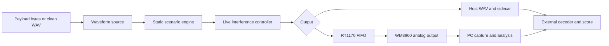

# M110 RT1170 waveform generator

This is the start-here guide for the waveform-generator project. It explains
what the project is, how to build and operate it, where each technical module
lives, and which evidence a successful run does and does not establish.

## Documentation levels

The documentation is written for four different reading depths. Every module
guide under [`docs/modules/`](docs/modules/README.md) uses the same structure.

| View | Read it when | What it answers |
|---|---|---|
| 50,000-foot view | You are deciding whether this project fits a task | What goes in, what comes out, and where the boundaries are |
| How to use it | You need to build, render, stage, play, capture, or replay | Commands, APIs, files, and safe operating sequence |
| Scientist and maintainer view | You need reproducibility, equations, limits, or code changes | Numerical conventions, ownership, state, bounded resources, diagnostics, and failure behavior |
| 5th-grader view | You need an intuition before the details | A concrete analogy with a small toy example |

## 50,000-foot view

The project makes controlled 48 kHz mono test audio and sends it through either
a host file pipeline or an NXP MIMXRT1170-EVK with a WM8960 codec. A clean source
can be a retained WAV or a waveform produced by a registered encoder. Ordered
channel impairments and interfering signals can then be mixed into the source.
The resulting stream can be written to another WAV, replayed through the codec,
captured from a PC audio input, and scored by an external decoder.



The impairment engine is waveform-agnostic. It sees PCM samples, not modem
symbols. M110B is currently the only registered native encoder, but playback,
mixing, capture, and replay do not depend on M110B internals.

This is an engineering fixture. A deterministic render, successful firmware
build, USB acknowledgment, analog capture, or decoder pass is evidence for that
specific path. None of those results alone establishes formal modem conformance.

## How to use it

### Build configurations

All commands run from this repository root. CMake 3.27 or newer is required.

| Preset family | Purpose | Typical command |
|---|---|---|
| `host-debug`, `host-release` | Host libraries, renderers, capture tool, encoder utility, and tests | `cmake --preset host-release` then `cmake --build --preset host-release --parallel` |
| `host-capture-debug`, `host-capture-release` | Build only `waveform_capture` in the matching host tree | `cmake --build --preset host-capture-release --parallel` |
| `rt1170-debug`, `rt1170-release` | Stopped RT1170 scaffold and board/runtime checkpoint | `cmake --preset rt1170-release` then `cmake --build --preset rt1170-release --parallel` |
| `rt1170-tone-*` | Resident deterministic codec-tone checkpoint | `cmake --preset rt1170-tone-release` then build the same preset |
| `rt1170-player-*` | Writable CDC plus MSC SD player, encoder, impairment, and live control | `cmake --preset rt1170-player-release` then build the same preset |
| `rt1170-player-readonly-*` | Read-only MSC/FatFs inspection player; artifact writes excluded | `cmake --preset rt1170-player-readonly-release` then build the same preset |
| `rt1170-sdcard-*` | SD socket and power-control diagnostic image | `cmake --preset rt1170-sdcard-release` then build the same preset |
| `rt1170-sdcard-identify-*` | Read-only card-identification diagnostic image | `cmake --preset rt1170-sdcard-identify-release` then build the same preset |

Host tests are explicit:

```powershell
ctest --preset host-release --output-on-failure
```

The Arm presets require the pinned Arm GNU toolchain path declared in
`CMakePresets.json`. Dependency materialization is a separate setup operation;
normal configure and build do not fetch from the network.

### Primary command-line interfaces

| Tool | Main options or subcommands | Purpose |
|---|---|---|
| `host/render_scenario.py` | `--scenario`, `--output`, `--base-dir`, `--overwrite` | Python reference rendering to WAV plus sidecar |
| `signal_lab_render.exe` | `--scenario`, `--source`, `--output`, `--sidecar`, `--target-scenario`, `--reference-rms`, `--block`, `--live-events` | Portable C++ scenario and live-replay rendering |
| `host/corpus_phase1.py` | `--spec`, `--root`, `--tx`, `--decoder`, `--engines`, `--stage`, `--only-modes`, `--jobs`, `--overwrite` | Reference, render, score, summary, and verification orchestration |
| `host/m110_score.py` | `--decoder`, `--engine`, `--expect-file`, `--jobs`, `--extra`, `--summary` | Decode and score one or more WAVs |
| `wfg_m110_tx.exe` | rate, interleave, output, message or `--file` | Create a clean M110B WAV or PCM file on the host |
| `host/stage_wav.py` | `inspect`, `make-tone`, `stage` | Validate and stage `/WG/PLAY.WAV` on an explicit card root |
| `host/live_control.py` | global identity/journal options plus `command`, `interactive`, `export`, `replay` | Operate and reproduce `WFG-LIVE/1` sessions |
| `host/tx_upload.py` | `--port`, `--expected-serial`, `--output`, `--mode`, payload source, `--record`, timeout options | Upload a payload or request SD-resident generation through DD008 |
| `waveform_capture.exe` | backend, device identity, channel, output, duration, controlled-stop options | Record the physical analog path to mono float WAV |
| `host/analyze_capture.py` | capture, `--output-json`, optional source/correlation and run thresholds | Measure capture integrity and optional source correlation |

The complete option reference and copy-ready commands are in
[Command-line Tools](docs/modules/command-line-tools.md).

### Example 1: render an impaired WAV offline

```powershell
python host/render_scenario.py `
  --scenario examples/field-light.json `
  --output build/runs/field-light.wav `
  --overwrite

build\host-release\host\render\signal_lab_render.exe `
  --scenario examples/field-light.json `
  --source clean.wav `
  --output build/runs/field-light-portable.wav `
  --sidecar build/runs/field-light-portable.json `
  --target-scenario build/runs/PLAY.SCN
```

The Python and portable paths are separate implementations of the same scenario
contract. Compare their PCM hashes when claiming deterministic equivalence.

### Example 2: create a clean M110B waveform

```powershell
build\host-release\host\tx\wfg_m110_tx.exe 600 long build\runs\hello.wav "HELLO"
build\host-release\host\tx\wfg_m110_tx.exe 1200 short build\runs\payload.wav --file payload.bin
```

### Example 3: stage, play, and capture through RT1170

Resolve the current CDC serial and SD volume from device identity. The values
below are placeholders, not remembered defaults.

```powershell
$port = 'COM42'
$serial = 'REPLACE_WITH_OBSERVED_USB_SERIAL'
$card = 'R:\'

python host/stage_wav.py stage build\runs\hello.wav --card-root $card

# Flush and dismount $card in Windows before this ownership transfer.
python host/live_control.py --port $port --expected-serial $serial `
  --record build\runs\load.jsonl --host-volume-dismounted `
  command "MEDIA LOCAL" "LOAD:PLAY.WAV"

python host/live_control.py --port $port --expected-serial $serial `
  --record build\runs\play.jsonl `
  command "CW 0 FREQ 900" "CW 0 CI 12" "CW 0 ON" "PLAY"

.\host\capture-session.ps1 `
  -Output build\runs\capture.wav `
  -DeviceName "Microphone (Realtek(R) Audio)" `
  -StopFile build\runs\capture.stop `
  -JsonlPath build\runs\capture.jsonl
```

Never let Windows MSC and firmware FatFs own the card simultaneously. Never use
a historical COM number or volume letter without resolving the current device.

### Example 4: export and replay a live-control schedule

```powershell
python host/live_control.py export build\runs\play.jsonl build\runs\play.replay.json

python host/live_control.py --port $port --expected-serial $serial `
  --record build\runs\replay.jsonl replay build\runs\play.replay.json

build\host-release\host\render\signal_lab_render.exe `
  --source clean.wav `
  --output build\runs\replayed-offline.wav `
  --live-events build\runs\play.replay.json
```

Replay positions are acknowledged output-frame positions. They are not host
wall-clock timestamps and do not prove the instant at which an analog DAC sample
became audible.

## Scientist and maintainer view

The project has four important contracts:

| Contract | Rule |
|---|---|
| Sample contract | Normalized float inside waveform and impairment paths; generated/source WAV is mono packed PCM24 at 48 kHz; captured host WAV is mono IEEE float at 48 kHz |
| Level contract | Internal full scale is `[-1, 1)`; C/I and SNR are relative to the declared clean-source reference RMS |
| Determinism contract | Scenario order, seed, source bytes, reference level, block-independent algorithms, float flags, and final PCM digest identify a render |
| Ownership contract | One owner mutates player/media/control state; host MSC and local FatFs ownership never overlap |

Static scenario processing is:

```text
PCM24 source -> normalize -> source gain -> ordered stages -> clip policy -> PCM24
```

Live processing follows the static engine and uses the emitted output-frame
coordinate:

```text
static output * live fade + four-slot CW bank + live static -> one saturation boundary
```

The C++ engine is bounded: 2048 input frames, 256 frames of expansion slack,
eight stages, 32 explicit events per bounded event list, and a 32 KiB placement
arena. The RT1170 player decouples SD/engine work from the codec deadline with a
65,536-frame output FIFO. These are design limits, not suggestions; changes need
tests at multiple caller block sizes and target memory accounting.

Build identity is independent of Git metadata. Configure writes a path-independent
first-party source manifest and combines it with dependency-lock and source-import
ledger hashes. Evidence should retain the source/scenario/payload hashes, exact
tool and firmware identity, commands, acknowledgments, counters, and capture files.

## 5th-grader view

Think of the project as a careful sound-effects laboratory. First it makes a
clean recording. Then it can turn knobs that add hiss, whistles, crashes, fades,
or tiny timing jumps. It writes down exactly when each knob moved. The computer
can save the result to a file, or the RT1170 board can play it through a real
headphone jack while another cable records it.

The strict rules are like sharing one notebook and one SD card. Only one person
may write at a time, every experiment gets a label and seed, and a successful
speaker test does not automatically mean a complete radio passed its standard.

## Technical module map

| Technical module | Primary code | Explainer |
|---|---|---|
| Static impairment engine | `signal-lab/`, `host/signal_lab/` | [Signal Lab Engine](docs/modules/signal-lab-engine.md) |
| Dynamic controls and deterministic replay | `common/live_*`, `signal-lab/src/live_control.cpp`, `host/live_control.py`, `host/render/live_replay.*` | [Live Control and Replay](docs/modules/live-control-and-replay.md) |
| Generic source and WAV generation | `waveform-source/` | [Waveform Source and Encoders](docs/modules/waveform-source-and-encoders.md) |
| Native M110B source | `native-m110/` | [Native M110B Waveform](docs/modules/native-m110-waveform.md) |
| Embedded player and codec pipeline | `rt1170/player.*`, `rt1170/platform/`, `rt1170/os/` | [RT1170 Player and Audio](docs/modules/rt1170-player-and-audio.md) |
| CDC, DD008, MSC, ownership, and artifacts | `common/`, `rt1170/usb*`, `rt1170/tx_*` | [Protocols, Media, and Artifacts](docs/modules/protocols-media-and-artifacts.md) |
| Physical audio capture and measurements | `host/capture/`, `host/analyze_capture.py` | [Host Capture and Analysis](docs/modules/host-capture-and-analysis.md) |
| Corpus production and decoder scoring | `host/corpus_phase1.py`, `host/render_scenario.py`, `host/m110_score.py`, `corpus/` | [Corpus Rendering and Scoring](docs/modules/corpus-rendering-and-scoring.md) |
| Presets, manifests, dependencies, and audits | `CMakeLists.txt`, `CMakePresets.json`, `cmake/`, `scripts/`, `schema/` | [Build Contracts and Provenance](docs/modules/build-contracts-and-provenance.md) |
| User-facing commands | `host/` entry points and host executables | [Command-line Tools](docs/modules/command-line-tools.md) |

Start with the [module documentation index](docs/modules/README.md). Phase reports
under `docs/` remain the chronological engineering record; module guides describe
the stable architecture and should be updated when a technical contract changes.

This directory is the standalone project root for the original
MIMXRT1170-EVK CM7 waveform-generator fixture. Its firmware replays retained
48 kHz mono packed-PCM24 WAV files through the EVK WM8960 codec. The PC remains the
device-under-test host and owns analog capture, M110 receive decoding, BER, and
the retained run record. Live CW, static and fade controls are recorded at exact
sample positions for replay. An independent encoder utility can create a clean
WAV on the PC or on the RT1170 SD card from a payload file or USB upload.

Current workflows are documented in [Phase 4 live control](docs/phase4-live-control.md)
and [Phase 5 artifact generation](docs/phase5-artifact-generator.md). M110B is the
first encoder adapter behind a generic PCM source and WAV writer; playback and
the impairment engine do not depend on a modem encoder.
See the [Phases 4–5 validation report](docs/phase4-5-implementation-report.md)
for the 20-test-suite result, firmware memory use and remaining hardware checks.

Phase 1.0 freezes the local file, protocol, counter, capture, decoder, evidence,
and qualification contracts. Phase 1.1 establishes independent host checks and
RT1170 scaffold/tone cross-builds. The historical P1.2 checkpoint established
host-to-microSD-to-codec playback. Phases 1–3 added deterministic scenarios and
the portable impairment engine; Phases 4–5 add live control and artifact creation.
Full WFG/1 qualification, packaging and the one-hour gate remain separate. A build,
resident tone, or short card playback is engineering evidence only; it does not
prove audio integrity, interoperability, or formal M110 conformance.

## Standalone boundary

All source, headers, linker inputs, build scripts, tests, and materialized vendor
files used by this project live below this directory. CMake does not add or
search the parent M110 project. An installed compiler, CMake, build runner,
Python, operating-system SDK, and programmer/debugger are tools and may reside
outside this directory. Separately supplied M110 producer/decoder executables
and WAV packages are explicit runtime artifacts; they are never implicit build
dependencies.

The dependency initialization script accepts explicit clean source checkouts,
verifies their locked commits, and copies the selected source into
`third_party/`. It is a setup operation and is never called by CMake. A normal
configure or build uses only the materialized local copy and works offline.

## Current build targets

Open this directory as the VS Code root; from the parent checkout the explicit
entry point is:

```powershell
code tools/waveform-generator/waveform-generator.code-workspace
```

The checked-in workspace and `.vscode/settings.json` bind CMake Tools to
`${workspaceFolder}` and this project's presets. All commands below run from
this directory:

CMake 3.27 or newer is required so a clean, one-pass configure emits the File
API records used by the standalone source-boundary audit.

```powershell
cmake --preset host-debug
cmake --build --preset host-debug --parallel
ctest --preset host-debug

cmake --preset host-release
cmake --build --preset host-release --parallel
ctest --preset host-release

cmake --preset rt1170-debug
cmake --build --preset rt1170-debug --parallel
cmake --preset rt1170-release
cmake --build --preset rt1170-release --parallel

cmake --preset rt1170-tone-debug
cmake --build --preset rt1170-tone-debug --parallel
cmake --preset rt1170-tone-release
cmake --build --preset rt1170-tone-release --parallel

cmake --preset rt1170-player-debug
cmake --build --preset rt1170-player-debug --parallel
cmake --preset rt1170-player-release
cmake --build --preset rt1170-player-release --parallel
cmake --preset rt1170-player-readonly-release
cmake --build --preset rt1170-player-readonly-release --parallel
```

The `rt1170-*` scaffold compiles the original-EVK board, FreeRTOS, WM8960, and
TinyUSB mechanisms but leaves playback unavailable. The `rt1170-tone-*` image is
an optional resident-code tone checkpoint. The `rt1170-player-*` image is the
composite CDC-plus-MSC microSD player. CDC commands hand the card between the PC
and firmware, select a WAV and play it. The normal player uses USB PID `0x4012`
and permits host staging and local artifact creation. The
`rt1170-player-readonly-*` inspection image uses PID `0x4013`, reports the LUN
write-protected, and rejects every WRITE10 before an SD write function can run.
It is suitable for inspecting an existing card without changing it, uses a
read-only FatFs build, and excludes the local artifact writer. The normal player
uses writable FatFs for artifact creation. Both support FAT12/16/32 and exFAT.
The engineering WFG-LIVE/1 protocol is separate from full WFG/1 qualification.

## Windows waveform capture

`waveform_capture.exe` records one explicit WinMM input as a streaming mono
48 kHz IEEE-float WAV. It selects the left channel by default; pass
`--channel right` or `--channel average` when the physical routing requires a
different policy. The callback only copies fixed-size blocks into a 512-block
bounded queue; a writer thread performs all disk I/O and patches the final
RIFF/data lengths after a controlled stop. READY and FINAL JSON Lines report the
selected policy and are written to stdout, with diagnostics and visible setup
failures on stderr.

For endpoints with system enhancements or APO processing, the same exact
friendly name can be selected through the event-driven raw WASAPI backend. It
uses the active endpoint's stable device ID, requests `AUDCLNT_STREAMOPTIONS_RAW`,
and accepts only the endpoint's actual 48 kHz PCM16 or IEEE-float mono/stereo
mix format; it does not silently resample.

Enumerate the current WinMM names before a run and select either the exact
native name or its numbered index:

```powershell
cmake --build --preset host-capture-release --parallel
build\host-release\host\capture\waveform_capture.exe --list-devices --json
build\host-release\host\capture\waveform_capture.exe --output capture.wav --device-name "Microphone (Realtek(R) Audio)" --sample-rate 48000 --channel left --max-seconds 4000 --stop-stdin
build\host-release\host\capture\waveform_capture.exe --backend wasapi-raw --output capture-raw.wav --device-name "Microphone (Realtek(R) Audio)" --sample-rate 48000 --channel left --max-seconds 4000 --stop-stdin
```

With `--stop-stdin`, send a line containing `STOP` for a controlled finish;
stdin EOF is recorded as `HOST_DISCONNECTED`. A duration limit, queue or write
error, non-finite sample, or interior partial WinMM buffer returns a visible
FINAL record and a nonzero exit status. Buffers returned by WinMM during reset
are drained and counted as `tail_samples`; those samples remain in the WAV.
The recorder does not perform a live capture during builds or tests.

The P1.0 standard-library checks reject duplicate/non-finite JSON, resolve every
local `$ref`, verify the recipes and their independent payload/tone arithmetic,
and check documentation links. A locked full Draft 2020-12 validation engine is
not materialized in P1.0; schema-engine validation and negative manifest/run
fixtures remain a P1.7 qualification-package acceptance item.

Use the boundary checker after a configure/build:

```powershell
$armGccRoot = Join-Path $env:USERPROFILE `
  '.mcuxpressotools\arm-gnu-toolchain-14.2.rel1-mingw-w64-x86_64-arm-none-eabi'
$cmakeRoot = Split-Path -Parent (Split-Path -Parent (Get-Command cmake).Source)
python scripts/verify-standalone.py --root . --build-dir build/rt1170-debug `
  --toolchain-root $armGccRoot --toolchain-root $cmakeRoot `
  --check-provenance --require-build-evidence
```

Each configure writes `build/<preset>/source-manifest.json`. The firmware build
identity includes the SHA-256 of that path-independent first-party manifest plus
the dependency-lock and import-ledger hashes; Git metadata is not required.

## P1.2 USB microSD staging

The early host utility is intentionally small. It can generate the frozen
10-second tone, reject a WAV outside the one supported format, write the frozen
WGM sidecar, copy both files to the fixed bring-up path, and verify the copied
hashes. It does not finalize qualification manifests or invoke an M110 producer
or decoder.

Run it from this project root. With the player image and card present, resolve
the fixture CDC endpoint by USB identity, set it to host mode, and wait for
Windows to assign the mass-storage volume. Replace the example COM port and
`R:\` with those explicitly identified endpoints; do not infer either from a
historical number or label.

```powershell
$fixturePort = 'COM15'
.\host\media-control.ps1 -Port $fixturePort -Action Host

python host/stage_wav.py make-tone --output build/staging/TONE10.WAV
python host/stage_wav.py inspect build/staging/TONE10.WAV
python host/stage_wav.py stage build/staging/TONE10.WAV --card-root R:\

# Flush and dismount R:\ through Windows before transferring card ownership.
.\host\media-control.ps1 -Port $fixturePort -Action Local -HostVolumeDismounted
.\host\media-control.ps1 -Port $fixturePort -Action Play
.\host\media-control.ps1 -Port $fixturePort -Action Status
```

The final two card files are `R:\WG\PLAY.WAV` and `R:\WG\PLAY.WGM`. The P1.2
host must flush and dismount `R:\` before sending `MEDIA LOCAL`, then send
`PLAY`. The helper requires `-HostVolumeDismounted` with `Local` so an accidental
command does not imply that CDC flushed Windows' filesystem cache. `STATUS`
reports media, player, SD-read, and codec/eDMA health counters. Firmware reads
the WAV once from microSD and treats the WGM as host-retained identity information;
full on-board sidecar/hash validation begins with WFG/1 ARM in P1.4. Never allow
Windows mass storage and firmware FatFs to own the card at the same time.
If `STATUS` shows the media as uninitialized or faulted after a card is inserted
or replaced, `Host` may be sent again while playback and FatFs are idle. The
firmware retains compatibility with the four-command P1.2 protocol: `OK MEDIA HOST` means the LUN is
already host-ready, while `OK MEDIA HOST INIT` means one initialization attempt
has started or is already in progress; a later `Status` reports the result.

The original EVK's physical card-detect signal is not usable on the tested board,
so the player deliberately assumes a card is present and lets `SD_CardInit`
establish whether it responds. Insert the card before reset. In this build,
`host_detect_status=1` records that configured assumption; it is not evidence
from a physical detect switch. The raw `cd_*` fields remain diagnostic only.
For a card that must not be changed, use the read-only preset and require both
Windows `IsReadOnly=True` and `STATUS msc_read_only=1`; do not run `stage_wav.py`.

The complete extraction gate copies this directory to an unrelated empty
location without Git metadata or prior build caches and repeats both host and
RT1170 Debug/Release builds with network access unnecessary. The command and
retained evidence are specified in [the local Phase 1 runbook](docs/phase1-implementation.md).

## Phase 1 test-waveform and impairment corpus

`host/signal_lab/` is the Phase 1 (Python) form of the waveform-agnostic
impairment engine described in the phased prompt (`docs/Prompt — Phased M110B
Test Waveform and Dynamic Interference Generator.md`). It processes 48 kHz mono PCM streams in 4096-frame blocks through ordered
stages (CW tone, static crashes, fades, band-limited AWGN, sample
deletion/duplication) driven by a portable scenario document and a seed; it
never inspects the protocol that produced the samples. Its level, noise-band
and seeding conventions are adopted from `tools/pcm_stress.py` (import
`m110-025`) so the shared models reproduce that renderer bit-exactly. The
three host scripts around it take the M110 producer and decoder as explicit
runtime executables, exactly like the rest of this project:

```powershell
$tx  = '..\..\build\host-windows-release\tools\m110_tx_to_pcm.exe'
$dec = '..\..\build\host-windows-release\tools\m110_app_decode.exe'
python host/corpus_phase1.py --tx $tx --decoder $dec --stage all --jobs 4   # refs -> validate -> render -> score -> summary
python host/corpus_phase1.py --stage verify                                  # re-render every scenario, compare PCM hashes
python host/render_scenario.py --scenario my-case.json --output my-case.wav  # one scenario
python host/m110_score.py --decoder $dec --engine siso <wav>...              # score arbitrary WAVs
python -m unittest tests.test_signal_lab -v
```

The default tests stay inside this repository. Historical comparisons against
the parent checkout are optional and require `WFG_PARENT_REFERENCE_TESTS=1`.
The first Python AWGN stage retains the legacy noise stream; additional AWGN
stages use distinct instance streams. Output peak/RMS describe the emitted
PCM24 samples, including saturation. Legacy PCM16 corpus score reuse checks the current WAV
hash, and verification fails if any planned sidecar is missing.

From Git Bash the WinLibs `mingw64/bin` directory must precede Git's own on
`PATH` before the M110 executables are run (see the parent repository's
`docs/process/M110-improvement-handoff.md`).

The corpus definition is [corpus/phase1-corpus.json](corpus/phase1-corpus.json);
the rendered corpus lives under `test-vectors/simulated-interference/<MODE>/`
with a JSON sidecar beside every WAV, per-file `*.siso.score.json` /
`*.adaptive.score.json` results, and hash-bearing manifests plus score CSVs
under `manifests/`. Only `payload/` and `manifests/` are tracked; everything
else is regenerated bit-exactly from the spec. The Phase 1 results and the
Phase 2 recommendation are in
[docs/phase1-test-waveform-report.md](docs/phase1-test-waveform-report.md).

## Phase 2 and 3: portable impairment engine and real-time RT1170 impairment

`signal-lab/` is the portable C++23 form of the same engine: normalized float in, ordered
impairment stages (band-limited AWGN, CW, static crashes, fades, sample
deletion/duplication), normalized float out with one PCM24 boundary quantizer,
with no heap, no exceptions and no C-library
transcendentals so the host renderer and the RT1170 produce sample-identical
streams (verified by the FNV-1a digests both report). The host library
`wfg_signal_lab`, the renderer `signal_lab_render` and the test
`wfg_signal_lab_tests` build with the host presets; the player firmware
compiles the same sources (`signal-lab/sources.cmake`).

```powershell
build\host-release\host\render\signal_lab_render.exe --scenario case.json --source clean.wav --output impaired.wav --sidecar impaired.json --target-scenario PLAY.SCN
```

`--target-scenario` writes the scenario with the effective `reference_rms`
inserted or replaced (including a `--reference-rms` override); copy it to
`G:\WG\PLAY.SCN` next to `PLAY.WAV`. The player image
loads it when `PLAY` starts and impairs every 4 KiB SD chunk in the player
task. The chain is producer-paced: SD read and engine feed a 65 536-frame
(1.37 s) output FIFO in OCRAM2 (generator-local linker script
`cmake/MIMXRT1176xxxxx_cm7_flexspi_nor_wfg.ld`), producing ahead of real time
until the 800 ms high watermark and sleeping until the 500 ms wake watermark;
only the 128-frame audio hook that drains the FIFO into SAI/eDMA has a hard
deadline. `STATUS` reports the engine (`engine_state`, `engine_error`,
`engine_frames_in/out`, `engine_clipped`, `engine_digest_hi/lo`,
`engine_source_digest_hi/lo`, `engine_max_block_cycles`,
`engine_events_applied/dropped`, `engine_arena_bytes`) and the FIFO/producer
safety metrics (`ring_capacity_frames`, `ring_high/wake_watermark_frames`,
`ring_critical_frames`, `ring_avg_frames`, `ring_min_pre_eof_frames`,
`ring_critical_events`, `producer_rate_sps`, `producer_worst_block_cycles`,
`producer_sleeps`, `max_sd_read_cycles`, `underruns`). Without a `PLAY.SCN`
the player is the clean pass-through it was before. `host/capture-session.ps1` runs `waveform_capture`
as a controlled session (READY, stop file, STOP, FINAL) for analog end-to-end
checks. Results, digests and the exact procedure are in
[docs/phase2-3-portable-engine-report.md](docs/phase2-3-portable-engine-report.md).

The portable engine accepts slip run lengths from 1 to 1024 samples. Its fixed
2304-frame output buffer also limits duplicate expansion to 256 samples in any
2048-source-frame window. Schedules exceeding that budget or requesting more
delivered history than exists are rejected during configuration, independently
of the caller's block size; they do not silently discard source samples.

`clip_policy: reject` latches a processing error on the first clipping block.
The host exits unsuccessfully before writing its output artifacts. The RT1170
stops playback without enqueueing that block and reports `engine_state=3`,
`engine_error=7`, and player error 16. Other processing failures use
`engine_error=8`. Configuration rejection remains `engine_state=2` with clean
playback. Earlier valid audio may already have played before a runtime error;
the player does not scan the entire source in advance. The source/sink helper
also returns failure when engine processing fails.

The PR 1 findings, Copilot assessments, and fix validation are recorded in
[docs/reviews/review-pr-1.md](docs/reviews/review-pr-1.md).

## Project records

- [Phase 1 implementation and qualification contract](docs/phase1-implementation.md)
- [First-party source import ledger](docs/source-imports.json)
- [Third-party dependency lock](dependencies.lock.json)
- [Third-party notices and licensing boundary](THIRD_PARTY_NOTICES.md)
- [Fixture recipes](fixtures/README.md)
- [Frozen JSON schemas](schema/)

Local build trees, virtual environments, and working run artifacts are ignored.
Evidence selected for a governed project record must be copied to its declared
retention location with hashes; an ignored `artifacts/` directory by itself is
not a sealed record.

PathSim remains an external preparation tool. No GPL PathSim source is imported
or linked here. A PathSim-rendered WAV is replayed directly as one test arm.
HFSimulator is a separate physical-channel arm. Combining the two impairments is
valid only for an explicitly declared cascaded-impairment experiment.
